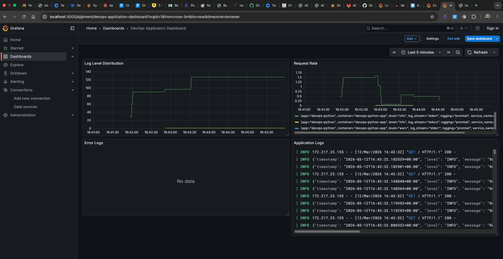
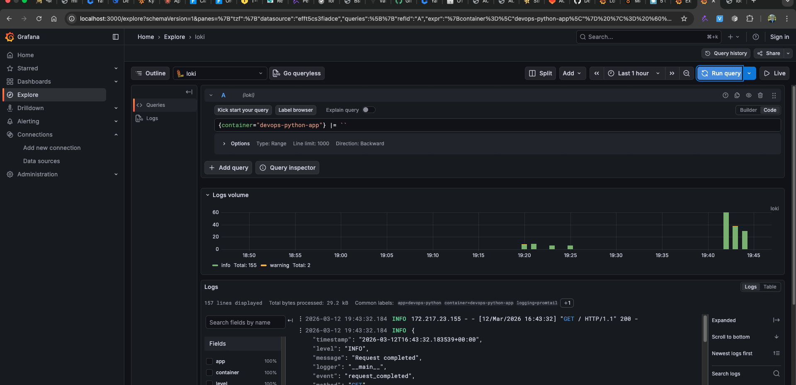
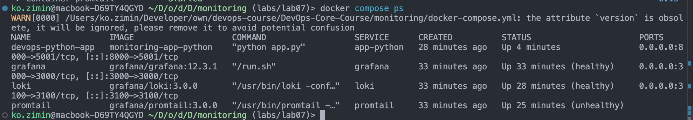
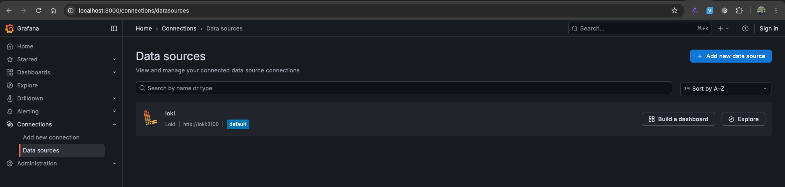

# Lab 07 — Observability & Logging with Loki Stack

## 1. Architecture

### Components Overview

```
┌─────────────────────────────────────────────────────────────────┐
│                        Docker Containers                        │
├─────────────────────────────────────────────────────────────────┤
│                                                                 │
│  ┌──────────────┐     ┌──────────────┐     ┌──────────────┐   │
│  │  app-python  │────▶│   Promtail   │◀────│    Loki      │   │
│  │  (Flask app) │     │  (log agent) │     │  (storage)   │   │
│  └──────────────┘     └──────────────┘     └──────────────┘   │
│         │                    │                    │            │
│         │                    │                    │            │
│         ▼                    ▼                    ▼            │
│    stdout logs         Docker socket        Port 3100         │
│                         /var/lib/docker                       │
│                                                                 │
└─────────────────────────────────────────────────────────────────┘
                              │
                              ▼
                    ┌──────────────┐
                    │   Grafana    │
                    │ (visualization)
                    │  Port 3000   │
                    └──────────────┘
```

### Data Flow

1. **app-python** writes JSON logs to stdout
2. **Docker** stores logs in `/var/lib/docker/containers`
3. **Promtail** reads logs via Docker socket, adds labels
4. **Loki** receives and stores logs (indexes only labels)
5. **Grafana** queries Loki using LogQL

---

## 2. Setup Guide

### Prerequisites

- Docker & Docker Compose installed
- Port 3000, 3100, 8000 available

### Deployment Steps

```bash
# Navigate to monitoring directory
cd monitoring

# Start the stack
docker compose up -d --build

# Verify all services are running
docker compose ps

# Expected output:
# NAME                 STATUS
# loki                 Up (healthy)
# promtail             Up (healthy)
# grafana              Up (healthy)
# devops-python-app    Up
```

### Verify Services

```bash
# Check Loki is ready
curl http://localhost:3100/ready

# Access Grafana
open http://localhost:3000
```

---

## 3. Configuration

### Loki Configuration (`loki/config.yml`)

| Setting                            | Value     | Description                 |
| ---------------------------------- | --------- | --------------------------- |
| `auth_enabled`                   | `false` | Disabled for development    |
| `server.http_listen_port`        | `3100`  | Loki API port               |
| `schema_config.store`            | `tsdb`  | TSDB storage (Loki 3.0+)    |
| `schema_config.schema`           | `v13`   | Schema version for Loki 3.0 |
| `limits_config.retention_period` | `168h`  | 7 days retention            |
| `compactor.retention_enabled`    | `true`  | Enable log cleanup          |

### Promtail Configuration (`promtail/config.yml`)

| Setting                     | Value                                 | Description              |
| --------------------------- | ------------------------------------- | ------------------------ |
| `server.http_listen_port` | `9080`                              | Promtail metrics port    |
| `clients.url`             | `http://loki:3100/loki/api/v1/push` | Loki endpoint            |
| `docker_sd_configs.host`  | `unix:///var/run/docker.sock`       | Docker socket            |
| `relabel_configs`         | Multiple                              | Extract container labels |

### Docker Compose Services

| Service        | Image                      | Port | Purpose           |
| -------------- | -------------------------- | ---- | ----------------- |
| `loki`       | `grafana/loki:3.0.0`     | 3100 | Log storage       |
| `promtail`   | `grafana/promtail:3.0.0` | 9080 | Log collection    |
| `grafana`    | `grafana/grafana:12.3.1` | 3000 | Visualization     |
| `app-python` | Custom build               | 8000 | Flask application |

---

## 4. Application Logging

### JSON Log Format

The Flask application logs in structured JSON format:

```json
{
  "endpoints": [
    {
      "description": "Service information",
      "method": "GET",
      "path": "/"
    },
    {
      "description": "Health check",
      "method": "GET",
      "path": "/health"
    }
  ],
  "request": {
    "client_ip": "172.217.23.155",
    "method": "GET",
    "path": "/",
    "user_agent": "Mozilla/5.0 (Macintosh; Intel Mac OS X 10_15_7) AppleWebKit/537.36 (KHTML, like Gecko) Chrome/145.0.0.0 Safari/537.36"
  },
  "runtime": {
    "current_time": "2026-03-12T16:24:37.144637+00:00",
    "timezone": "UTC",
    "uptime_human": "0 hours, 5 minutes",
    "uptime_seconds": 314
  },
  "service": {
    "description": "DevOps course info service",
    "framework": "Flask",
    "name": "devops-info-service",
    "version": "1.0.0"
  },
  "system": {
    "architecture": "aarch64",
    "cpu_count": 14,
    "hostname": "f56539f2d83a",
    "platform": "Linux",
    "platform_version": "6.10.14-linuxkit",
    "python_version": "3.13.12"
  }
}
```

### Log Events

| Event                 | Description           | Fields                                 |
| --------------------- | --------------------- | -------------------------------------- |
| `request_started`   | Incoming HTTP request | method, path, remote_addr, user_agent  |
| `request_completed` | Response sent         | method, path, status_code, duration_ms |

### Implementation

```python
class JSONFormatter(logging.Formatter):
    def format(self, record):
        log_data = {
            "timestamp": datetime.now(timezone.utc).isoformat(),
            "level": record.levelname,
            "message": record.getMessage(),
            "logger": record.name,
        }
        # Add extra fields
        for field in ['event', 'method', 'path', 'status_code', 'duration_ms']:
            if hasattr(record, field):
                log_data[field] = getattr(record, field)
        return json.dumps(log_data)
```

---

## 5. Dashboard Panels

### Panel 1: Application Logs

| Setting                 | Value                               |
| ----------------------- | ----------------------------------- |
| **Query**         | `{container="devops-python-app"}` |
| **Visualization** | Logs                                |
| **Purpose**       | View all application logs           |

### Panel 2: Request Rate

| Setting                 | Value                                         |
| ----------------------- | --------------------------------------------- |
| **Query**         | `rate({container="devops-python-app"}[1m])` |
| **Visualization** | Time series                                   |
| **Purpose**       | Requests per second over time                 |

### Panel 3: Error Logs

| Setting                 | Value                            |
| ----------------------- | -------------------------------- |
| **Query**         | `{container="devops-python-app"} |
| **Visualization** | Logs                             |
| **Purpose**       | Filter only error logs           |

### Panel 4: Log Level Distribution

| Setting                 | Value                                                                     |
| ----------------------- | ------------------------------------------------------------------------- |
| **Query**         | `sum by (level) (count_over_time({container="devops-python-app"}[5m]))` |
| **Visualization** | Graph                                                                     |
| **Purpose**       | Distribution of log levels                                                |

---

## 6. Production Configuration

### Resource Limits

All services have CPU and memory constraints:

```yaml
deploy:
  resources:
    limits:
      cpus: '1.0'
      memory: 1G
    reservations:
      cpus: '0.5'
      memory: 512M
```

### Health Checks

| Service  | Health Endpoint                      |
| -------- | ------------------------------------ |
| Loki     | `http://localhost:3100/ready`      |
| Promtail | `http://localhost:9080/ready`      |
| Grafana  | `http://localhost:3000/api/health` |

### Security Considerations

**For Production:**

1. Disable anonymous auth in Grafana:

   ```yaml
   environment:
     - GF_AUTH_ANONYMOUS_ENABLED=false
     - GF_SECURITY_ADMIN_PASSWORD=<secure-password>
   ```
2. Use secrets management (`.env` file, not committed):

   ```bash
   # .env file
   GF_SECURITY_ADMIN_PASSWORD=supersecret
   ```
3. Remove Docker socket access or use sidecar pattern

### Retention Policy

- **Retention period:** 168 hours (7 days)
- **Compactor:** Enabled for automatic cleanup
- **Storage:** Local filesystem (use S3/GCS for production)

---

## 7. Testing Commands

```bash
# Generate test traffic
for i in {1..20}; do curl -s http://localhost:8000/ > /dev/null; done
for i in {1..10}; do curl -s http://localhost:8000/health > /dev/null; done

# View application logs
docker compose logs app-python | tail -20

# Check Loki status
curl http://localhost:3100/ready

# List all containers
docker compose ps
```

### LogQL Test Queries

```logql
# All logs from app
{container="devops-python-app"}

# Filter by event type
{container="devops-python-app"} | json | event="request_completed"

# Error logs only
{container="devops-python-app"} |= "ERROR"

# Request rate
rate({container="devops-python-app"}[1m])

# Count by log level
sum by (level) (count_over_time({container="devops-python-app"} | json [5m]))
```

---

## 8. Challenges & Solutions

### Challenge 1: Loki 3.0 Configuration

**Problem:** Loki 3.0 has different config schema than 2.x

**Solution:** Used TSDB storage with schema v13, removed deprecated fields:

- Removed `shared_store` from tsdb_shipper
- Removed `max_transfer_retries` from ingester
- Removed `query_timeout` from querier

### Challenge 2: Promtail Filters

**Problem:** `filters` field not supported in Promtail config

**Solution:** Used `relabel_configs` with `action: keep/drop`:

```yaml
relabel_configs:
  - source_labels: ['__meta_docker_container_label_logging']
    regex: 'promtail'
    action: keep
```

### Challenge 3: Python JSON Logging

**Problem:** `extra` parameter must be dict, not LogRecord object

**Solution:** Pass dict directly to `extra={}` in logger calls

## 9. Evidence

### Screenshots


*1 — Dashboard with 4 panels*


*2 — Logs in Explore*


*3 — All services healthy*


*4 — Loki data source is connected*

### LogQL Queries Demonstrated

- `{container="devops-python-app"}` - All logs
- `{container="devops-python-app"} |= "ERROR"` - Error filter
- `rate({container="devops-python-app"}[1m])` - Metrics
- `sum by (level) (...)` - Aggregation

---

## 10. Summary

This lab implemented a complete logging stack using:

- **Loki 3.0** - Modern log aggregation with TSDB storage
- **Promtail** - Docker log collection with service discovery
- **Grafana 12** - Visualization and LogQL queries
- **Flask App** - Structured JSON logging

**Key Learnings:**

- Loki indexes only labels, not log content
- Structured logging enables powerful queries
- LogQL is similar to PromQL for metrics
- Production requires security hardening
