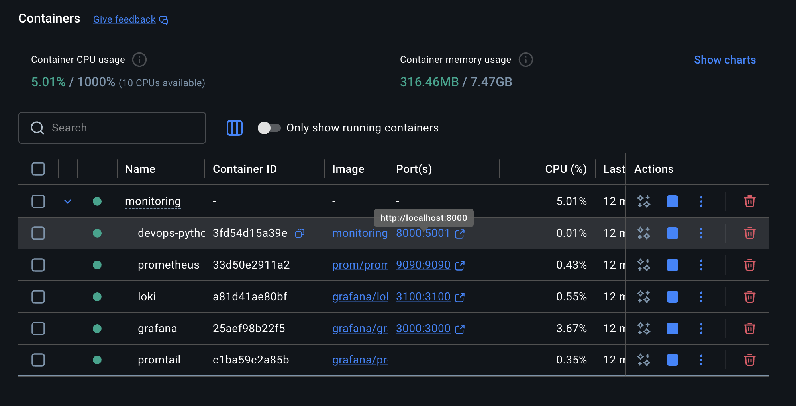
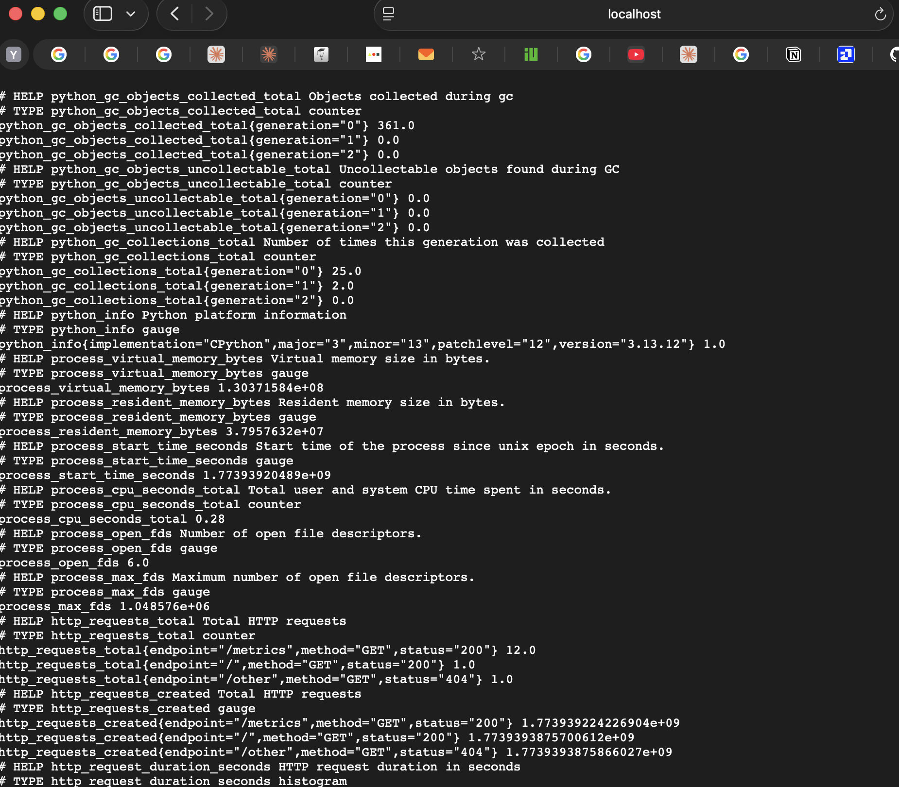
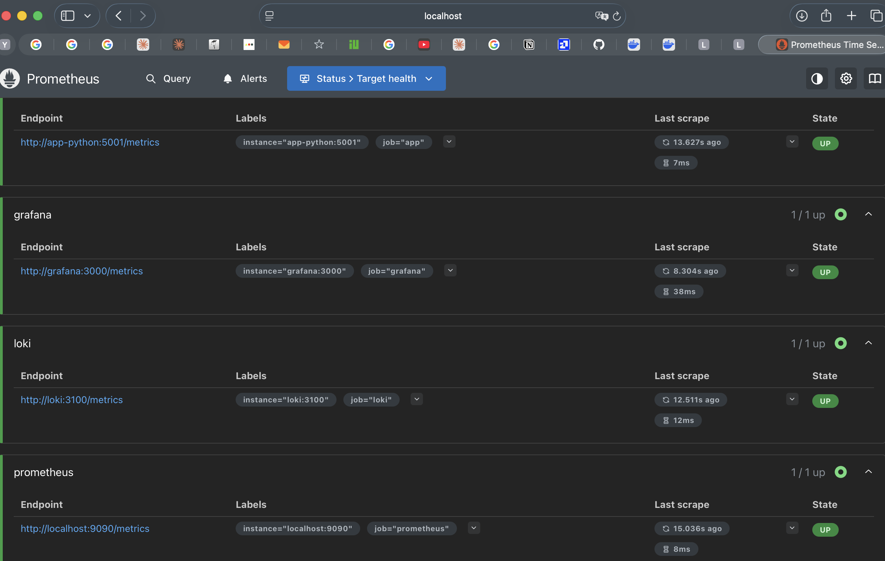
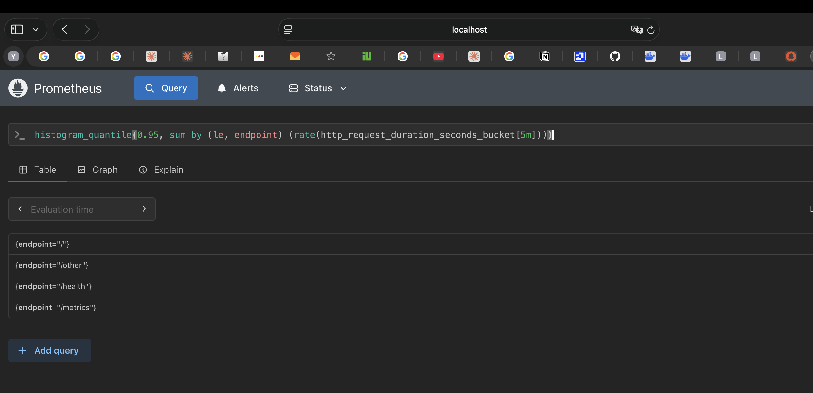
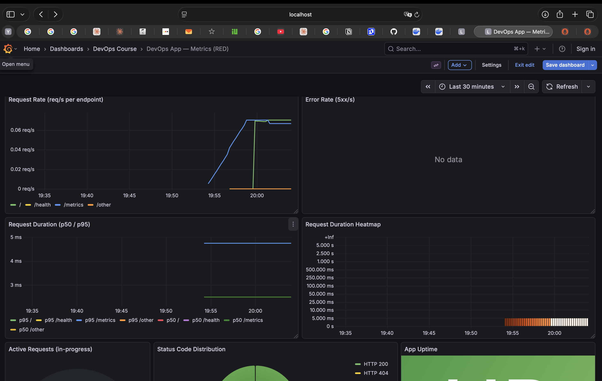

# Lab 8 — Metrics & Monitoring with Prometheus

## 1. Architecture

```
┌─────────────────────────────────────────────────────────────────┐
│                        Docker Network: logging                  │
│                                                                 │
│  ┌──────────────┐   scrape /metrics    ┌────────────────────┐  │
│  │  app-python  │ ◄─────────────────── │    prometheus      │  │
│  │  :5001       │                      │    :9090           │  │
│  └──────────────┘                      └────────┬───────────┘  │
│                                                 │               │
│  ┌──────────────┐   scrape /metrics             │ query         │
│  │    loki      │ ◄─────────────────────────────┤ PromQL       │
│  │  :3100       │                               │               │
│  └──────────────┘                      ┌────────▼───────────┐  │
│                                        │     grafana        │  │
│  ┌──────────────┐   logs push          │     :3000          │  │
│  │  promtail    │ ──────────────────►  │  datasources:      │  │
│  └──────────────┘                      │   - Prometheus     │  │
│                                        │   - Loki           │  │
│                                        └────────────────────┘  │
└─────────────────────────────────────────────────────────────────┘
```

**Data flow:**
1. The Flask app exposes `/metrics` (Prometheus text format)
2. Prometheus scrapes all targets every 15 s and stores time-series in TSDB
3. Grafana queries Prometheus via PromQL and renders dashboards
4. Loki is also scraped by Prometheus (infrastructure metrics)

---

## 2. Application Instrumentation

### Metrics added to `app_python/app.py`

| Metric | Type | Labels | Purpose |
|--------|------|--------|---------|
| `http_requests_total` | Counter | method, endpoint, status | Total requests — tracks **Rate** and **Errors** (RED) |
| `http_request_duration_seconds` | Histogram | method, endpoint | Latency distribution — tracks **Duration** (RED) |
| `http_requests_in_progress` | Gauge | — | Current concurrency |
| `devops_info_endpoint_calls_total` | Counter | endpoint | Business-level call counting per route |
| `devops_info_system_collection_seconds` | Histogram | — | Cost of `get_system_info()` function |

### Why these choices

- **Counter** for `http_requests_total`: counters never decrease, ideal for monotonically-increasing event counts.
- **Histogram** for duration: allows computing p50/p95/p99 percentiles via `histogram_quantile()`. Buckets are tuned for a lightweight Flask service (5 ms – 5 s).
- **Gauge** for in-progress: value goes both up and down with each request lifecycle.
- Low-cardinality labels only: endpoints are normalised (`/`, `/health`, `/metrics`, `/other`) to prevent label explosion.

### Key implementation details

```python
# Normalise endpoint path to avoid high-cardinality labels
def _normalize_endpoint(path: str) -> str:
    if path == '/': return '/'
    if path.startswith('/health'): return '/health'
    if path.startswith('/metrics'): return '/metrics'
    return '/other'

# before_request — start timer and increment gauge
http_requests_in_progress.inc()
request.start_time = time.monotonic()

# after_request — record all metrics atomically
http_requests_in_progress.dec()
http_requests_total.labels(method, endpoint, status).inc()
http_request_duration_seconds.labels(method, endpoint).observe(duration)
```

---

## 3. Prometheus Configuration

**File:** `monitoring/prometheus/prometheus.yml`

```yaml
global:
  scrape_interval: 15s
  evaluation_interval: 15s

scrape_configs:
  - job_name: 'prometheus'   # self-monitoring
    static_configs:
      - targets: ['localhost:9090']

  - job_name: 'app'          # Flask service (internal port 5001)
    static_configs:
      - targets: ['app-python:5001']
    metrics_path: '/metrics'

  - job_name: 'loki'
    static_configs:
      - targets: ['loki:3100']

  - job_name: 'grafana'
    static_configs:
      - targets: ['grafana:3000']
```

**Retention** (set via CLI flags in docker-compose):
- Time: 15 days
- Size: 10 GB (whichever limit is hit first triggers compaction/deletion)

**Why 15 s scrape interval?** Short enough to catch spikes, long enough not to overload small services. Decrease to 5 s if sub-minute alerting is needed.

---

## 4. Dashboard Walkthrough

Dashboard title: **DevOps App — Metrics (RED)**
Auto-provisioned from `monitoring/grafana/provisioning/dashboards/app-dashboard.json`.

| Panel | Type | PromQL | Purpose |
|-------|------|--------|---------|
| Request Rate | Time series | `sum by (endpoint) (rate(http_requests_total[5m]))` | Requests per second per endpoint |
| Error Rate | Time series | `sum(rate(http_requests_total{status=~"5.."}[5m]))` | 5xx errors per second |
| Request Duration p50/p95 | Time series | `histogram_quantile(0.95, ...)` | Latency percentiles |
| Request Duration Heatmap | Heatmap | `sum by (le) (rate(http_request_duration_seconds_bucket[5m]))` | Full latency distribution |
| Active Requests | Gauge | `http_requests_in_progress` | Concurrent request count |
| Status Distribution | Pie chart | `sum by (status) (rate(http_requests_total[5m]))` | 2xx / 4xx / 5xx split |
| App Uptime | Stat | `up{job="app"}` | Service availability (1=UP, 0=DOWN) |

---

## 5. PromQL Examples

```promql
# 1. Overall request rate (all endpoints combined)
sum(rate(http_requests_total[5m]))

# 2. Request rate broken down by endpoint
sum by (endpoint) (rate(http_requests_total[5m]))

# 3. Error rate as a percentage of total traffic
sum(rate(http_requests_total{status=~"5.."}[5m]))
  /
sum(rate(http_requests_total[5m])) * 100

# 4. p95 latency per endpoint
histogram_quantile(
  0.95,
  sum by (le, endpoint) (rate(http_request_duration_seconds_bucket[5m]))
)

# 5. p50 (median) latency across all endpoints
histogram_quantile(
  0.50,
  sum by (le) (rate(http_request_duration_seconds_bucket[5m]))
)

# 6. Services that are currently DOWN
up == 0

# 7. CPU usage of the Python process
rate(process_cpu_seconds_total{job="app"}[5m]) * 100

# 8. Business metric — calls to the root endpoint
rate(devops_info_endpoint_calls_total{endpoint="/"}[5m])
```

---

## 6. Production Setup

### Health checks

Every service has a Docker health check:

| Service | Check | Interval |
|---------|-------|----------|
| loki | `wget /-/ready` | 10 s |
| promtail | `wget /ready` | 10 s |
| prometheus | `wget /-/healthy` | 10 s |
| grafana | `wget /api/health` | 10 s |
| app-python | `curl /health` | 10 s |

### Resource limits

| Service | CPU limit | Memory limit |
|---------|-----------|--------------|
| prometheus | 1.0 | 1 G |
| loki | 1.0 | 1 G |
| grafana | 0.5 | 512 M |
| app-python | 0.5 | 256 M |
| promtail | 0.5 | 256 M |

### Data retention

- **Prometheus:** `--storage.tsdb.retention.time=15d` + `--storage.tsdb.retention.size=10GB`
- **Loki:** `retention_period: 168h` (7 days) in `loki/config.yml`

### Persistent volumes

```yaml
volumes:
  prometheus-data:   # Prometheus TSDB
  loki-data:         # Loki chunks + index
  grafana-data:      # Grafana dashboards, users, settings
```

Volumes survive `docker compose down` and are restored on `docker compose up -d`.

---

## 7. Testing Results

### Verification steps

```bash
# 1. Start the stack
cd monitoring
docker compose up -d --build

# 2. Check all containers healthy
docker compose ps

# 3. Verify /metrics endpoint on the app
curl http://localhost:8000/metrics | head -30

# 4. Check Prometheus targets
# Open: http://localhost:9090/targets
# All 4 jobs should show State: UP

# 5. Run a PromQL query
curl 'http://localhost:9090/api/v1/query?query=up'

# 6. Open Grafana dashboard
# http://localhost:3000 → Dashboards → DevOps Course → DevOps App — Metrics (RED)

# 7. Test persistence
docker compose down
docker compose up -d
# Dashboard still exists, Prometheus data still present
```

### Expected `/metrics` output (sample)

```
# HELP http_requests_total Total HTTP requests
# TYPE http_requests_total counter
http_requests_total{endpoint="/",method="GET",status="200"} 42.0
http_requests_total{endpoint="/health",method="GET",status="200"} 15.0

# HELP http_request_duration_seconds HTTP request duration in seconds
# TYPE http_request_duration_seconds histogram
http_request_duration_seconds_bucket{endpoint="/",le="0.005",method="GET"} 38.0
http_request_duration_seconds_bucket{endpoint="/",le="0.01",method="GET"} 42.0
...
http_request_duration_seconds_count{endpoint="/",method="GET"} 42.0
http_request_duration_seconds_sum{endpoint="/",method="GET"} 0.21

# HELP http_requests_in_progress HTTP requests currently being processed
# TYPE http_requests_in_progress gauge
http_requests_in_progress 0.0
```

### Screenshots

**All containers healthy** (`docker compose ps`):



**`/metrics` endpoint output:**



**Prometheus targets — all jobs UP:**



**Prometheus PromQL query (`up`):**



**Grafana RED dashboard with live data:**



---

## 8. Challenges & Solutions

| Challenge | Solution |
|-----------|----------|
| Port mapping confusion (`8000:5001`) — Prometheus must use the **internal** container port | Set scrape target to `app-python:5001` (not `8000`) |
| `generate_latest()` must NOT be wrapped in `jsonify()` — content type must be `text/plain` | Returned raw `Response(generate_latest(), mimetype=CONTENT_TYPE_LATEST)` |
| `/metrics` endpoint itself would be tracked and skew request counters | Normalised paths suppress `/metrics` as a separate label; the scrape requests are still counted but clearly labeled |
| High-cardinality label risk (e.g. using full URL path) | Implemented `_normalize_endpoint()` to collapse paths to a small fixed set |
| Grafana data sources must be available before Grafana starts | Added `depends_on: prometheus` to Grafana service; provisioning via YAML files is idempotent |

---

## Metrics vs Logs (Lab 7 vs Lab 8 Comparison)

| Aspect | Logs (Lab 7 — Loki) | Metrics (Lab 8 — Prometheus) |
|--------|---------------------|------------------------------|
| Data shape | Unstructured/structured text events | Numeric time-series |
| Best for | Debugging, root cause analysis | Trending, alerting, dashboards |
| Storage | Higher per-event cost | Highly compressed (TSDB) |
| Query language | LogQL | PromQL |
| When to use | "Why did this request fail?" | "How many requests are failing?" |
| Retention | 7 days (Loki) | 15 days (Prometheus) |

**Together** they form two pillars of the observability triangle (the third being distributed traces).
